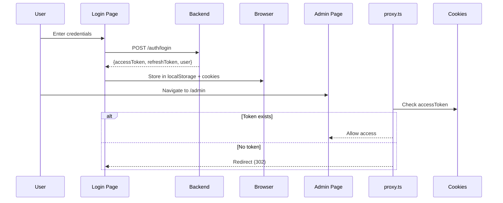

# Next.js 16 Proxy Authentication

This project uses Next.js 16's new `proxy.ts` feature for server-side route protection.

## How It Works

### 1. proxy.ts Middleware

The [proxy.ts](proxy.ts) file acts as a server-side middleware that runs before routes are rendered:

```typescript
export const config = {
  matcher: ["/admin/:path*"], // Protect all /admin/* routes
};
```

- **Protected Routes**: All `/admin/*` routes require authentication
- **Public Routes**: `/` (home) and `/login` are publicly accessible
- **Token Validation**: Checks for `accessToken` cookie on each request
- **Auto-redirect**: Unauthenticated users are redirected to `/login` with return URL

### 2. Cookie-based Authentication

Tokens are stored in both localStorage and cookies:

- **localStorage**: For client-side API calls (axios interceptors)
- **Cookies**: For server-side middleware (proxy.ts) access

### 3. AuthContext Integration

[AuthContext.tsx](contexts/AuthContext.tsx) manages authentication state:

- Handles login/logout operations
- Stores tokens in both localStorage and cookies
- Manages axios interceptors for auto token refresh
- Syncs authentication state across client and server

## Benefits Over Client-Side Auth

1. **Security**: Server-side validation before page renders
2. **Performance**: No client-side redirect flash
3. **SEO**: Proper HTTP redirects (302) instead of client-side navigation
4. **Reliability**: Works even with JavaScript disabled

## Authentication Flow



## Token Management

### Access Token

- **Duration**: 15 minutes
- **Storage**: localStorage + cookie
- **Purpose**: API authentication
- **Refresh**: Auto-refreshed by axios interceptor on 401

### Refresh Token

- **Duration**: 7 days
- **Storage**: localStorage + cookie
- **Purpose**: Obtain new access tokens
- **Usage**: Called when access token expires

## Configuration

### Environment Variables

```bash
JWT_SECRET=your_secret_key
JWT_REFRESH_SECRET=your_refresh_secret_key
```

### Cookie Settings

```typescript
// Access token cookie (1 day)
setCookie("accessToken", token, 1);

// Refresh token cookie (7 days)
setCookie("refreshToken", token, 7);
```

## Testing Authentication

1. **Test Protected Route**:

   - Navigate to `/admin` without logging in
   - Should redirect to `/login?redirect=/admin`

2. **Test Login**:

   - Login with valid credentials
   - Should redirect to `/admin` (or original route from query param)

3. **Test Logout**:

   - Click logout button
   - Should clear cookies and redirect to `/login`

4. **Test Token Refresh**:
   - Wait for access token to expire (15 min)
   - Make API call - should auto-refresh and retry

## Troubleshooting

### Routes Not Protected

- Check `config.matcher` in [proxy.ts](proxy.ts)
- Verify cookies are being set correctly
- Check browser DevTools > Application > Cookies

### Redirect Loop

- Ensure login page is excluded from matcher
- Verify token is being stored correctly
- Check for token expiry

### Token Not Found

- Verify cookie SameSite policy
- Check cookie domain and path settings
- Ensure cookies are not blocked by browser

## Migration from Client-Side Auth

Previous implementation used `useEffect` in AuthContext to handle redirects. This caused:

- Flash of wrong content before redirect
- Client-side only validation
- Poor SEO with client-side navigation

New implementation with `proxy.ts`:

- Server-side validation before render
- Proper HTTP redirects
- No content flash
- Better security and performance
